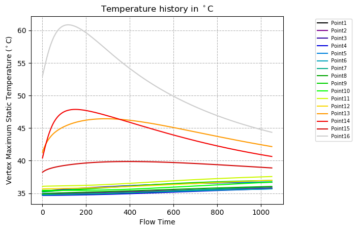

# spectral-line-plots
Plot multiple lines with spectral colors to simultaneously compare similar datasets. Uses Python3,  matplotlib and numpy. 

Consider a case where need to compare not only the final values of tabular datasets from multiple text files, but also how the values rise or fall with respect to each other. Plotting them all together in a single X-Y plot with spectral colors allows us to easily distinguish each line from the other and study trends with minimum effort. 

The input data for this example ("ExampleData/") came from an external package that output temperature data vs. time. The script uses regular expressions to parse the contents of the headers in each file, and if it finds the word "Temperature", it converts the data to deg Celsius. 

The script outputs two files - one image file ("convergencePlot.png") containing the spectral line plot, and a .dat table ("TableData.dat") containing the last values from each column of the input data. 

